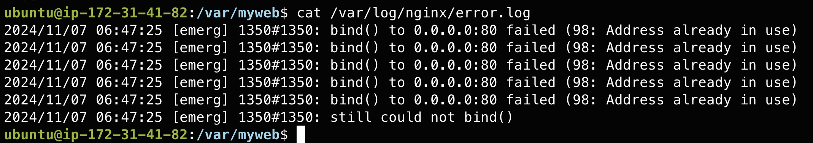

# week-09

## Report

1. **Syntax error**
```unexpected ";" in /etc/nginx/nginx.conf:8```
解決方法： ```sudo vim /etc/nginx/nginx.conf``` 把對應 ```;``` 去除。

2. **port:80 被佔用**
  


```bash
sudo kill srv
```

3. **防火牆設定**


透過 ```sudo iptables -L``` 看設定發現有個REJECT，所以用底下指令刪除並儲存防火牆設定。

```bash
sudo iptables -D INPUT -p tcp --dport 80 -j REJECT
sudo iptables-save > /etc/iptables/rules.v4
```

4. **/etc/myweb 權限不足**


看 ```/etc/nginx/sites-enabled/default``` 中有 ```root /var/myweb```，又遇到```403 Forbidden```，所以到```/var/myweb``` 更改權限。

```bash
sudo chmod 644 /var/myweb/index.html 
```

5. **成功**


